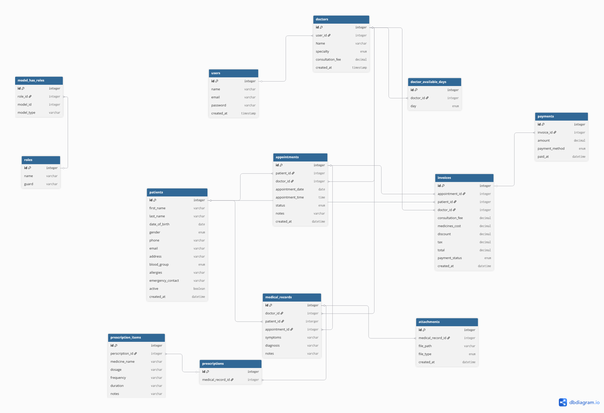

# Clinic Management System API

A secure Laravel backend API for managing a multi-doctor clinic.  
Built for practice purposes to apply clean code principles and Laravel best practices.

## Tech Stack
- Laravel 12
- Laravel Sanctum (API Authentication)
- Spatie Laravel Permission (Roles & Permissions)
- MySQL

## Features
- Doctor and patient management
- Appointment booking and tracking
- Medical records with prescriptions
- Invoice and payment management
- Role-based access control (Super Admin, Doctor, Receptionist, Accountant)

## Roles & Permissions
| Role | Access |
|------|--------|
| Super Admin | Full access |
| Doctor | Appointments, Medical Records, Prescriptions |
| Receptionist | Patients, Appointments |
| Accountant | Invoices, Reports |

## Database Schema


## Setup
```bash
composer install
cp .env.example .env
php artisan key:generate
php artisan migrate:fresh --seed
```